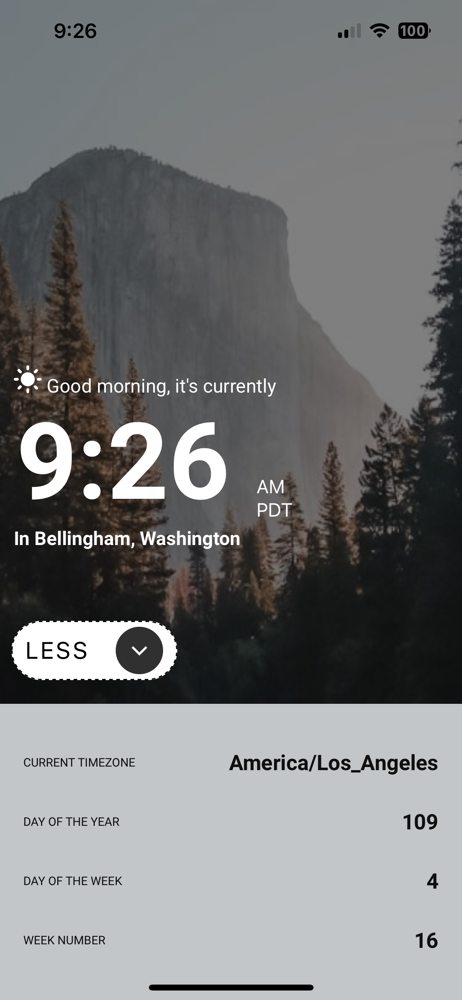

## React Native Clock App
This project is a dynamic clock app for both Android and iOS. It displays information about time, timezone, date, and has a daily refreshable quote! The app fetches data from the [WorldTimeAPI](https://worldtimeapi.org/), [ip-API](https://ip-api.com/) and [quotable API](https://docs.quotable.io/).

## Captures

## Setup
To run the app in the testing environment, please ensure you have Node.js, npm, and a mobile device with Expo Go.
First, run
npm install
followed by
npx expo start
Then, scan the QR code displayed on screen with your mobile device to check out the app!